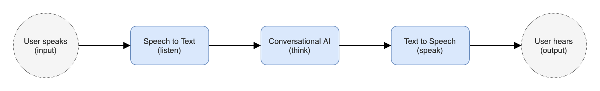

# ImprovBot

ImprovBot is a web-based prototype intended
for UBC Biomedical Visualization Certificate program.
It provides improvised conversations with AI agents
to help students practice communcation and negotiation skills with clients.
This repository is a demo for a basic technical implementation of ImprovBot.

## Installation

1. Clone this repository.

2. Run setup from the repository root directory.

   ```bash
   bash setup.sh
   ```

3. Start Python virtual environment.

   ```bash
   source ./venv/bin/activate
   ```

## Usage

To use the demo,
you need to host two servers,
one for Rasa server and one for Flask application.

- Run the following command to start the Rasa server
  with trained model.

  ```bash
  rasa run --enable-api --model meredith.tar.gz
  ```

- Run the following command to start the Flask server.

  ```bash
  flask run
  ```

After both servers are running,
you should be able to access and experience the demo
at http://127.0.0.1:5000.

## Approach

To achieve this, we designed a simple pipeline
that takes user input in speech (audio)
and output with a verbal response by AI.
The pipeline is consist of three major steps.
Firstly, speech-to-text is used to transcribe audio into text.
Then, the text gets processed by a conversational AI
with natrual language understanding
and able to give a response in text.
After that, the response by AI is synthesized into an audio file
and send to the user.



## Acknowledgement

- [Whisper](https://github.com/openai/whisper)
  provided amazing speech recognition system.

- [Rasa](https://rasa.com)
  was used for custom training client AI.

- [pyttsx3](https://github.com/nateshmbhat/pyttsx3)
  provided great offline text-to-speech functionality.

- [Flask](https://flask.palletsprojects.com/en/2.2.x/)
  allowed rapid Python web development.
